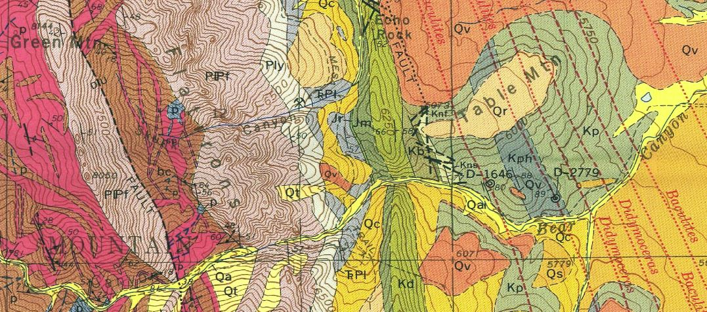

# Geologic Maps and Cross Sections in QGIS
Workshop for QGIS NA 2020 introducing geologic maps and cross-sections for students and hobbyists

*Detail of Eldorado Springs Geologic Quadrangle, Wells, 1967*

## What this tutorial will cover:

Introduction to the rock cycle and main rock types:
- igneous
- sedimentary
- metamorphic

Quick look at the Geologic Time Scale

Orientation to some geologic terms and structures
- strike and dip
- antclines, synclines and monoclines
- faults (normal, thrust or reverse, strike/slip)

2D geologic graphics with  and 
- import geologic symbol libraries
- stylize a geologic map
- create a geologic cross section with the qprof plugin and Inkscape

You'll learn how to interpret the symbols on a geologic map that represent the surface exposure of sedimentary layers. You'll also get a start on how the information from this surficial data can help estimate what the formations look like underground.

## What this tutorial won't do:

This tutorial won't make you a structural geologist qualified to make geologic maps from scratch. Real geologic maps are based on mind-boggling amounts of scientific training and field work. For more information see this [USGS description](https://www.usgs.gov/core-science-systems/national-cooperative-geologic-mapping-program/science/introduction-geologic?qt-science_center_objects=0#qt-science_center_objects)

# GEOLOGY!
## Part I: Rocks & Time

*The Rock Cycle*

The surface of the earth is a dynamic system and this applies to rocks as well! The time scale is on a longer extent than what we can see in the motion of water, for example. It's harder for our brains to grasp, but rocks do move.

The simplistic summary of the rock cycle is: 
- Molten material from levels below the earth's crust cools into solid rocks as it comes to or near to the earth's surface creating igneous rocks.
- Erosion wears existing rocks into sediment or dissolved chemicals that generally get carried from higher elevations and deposited into flat layers at lower elevations.
- These layers get buried and compressed and turned into sedimentary rocks. If they get exposed to an environment with enough heat and pressure to start changing the mineral structure, they become metamorphic rocks or melt completely again.

There are many different subsets of rock types under the three main just mentioned (*igneous*, *sedimentary* and *metamorphic*). The difference between them depends on chemical compositions and mineral sizes, both factors being dependent on the environment in which the rock was formed. See this [page](https://geology.utah.gov/map-pub/survey-notes/glad-you-asked/igneous-sedimentary-metamorphic-rocks/) for more details.

Here are some classic examples of the three main rock types:

GRANITE (an igneous rock type):

*By I, Friman, CC BY-SA 3.0, https://commons.wikimedia.org/w/index.php?curid=2421115*

SANDSTONE (a sedimentary rock type):

*By Hasmodius, CC BY-SA 4.0 https://commons.wikimedia.org/wiki/File:Valley_of_Fire_Sandstone_layers_exposed_by_erosion.jpg*

MIGMATITE (a metamporhic rock type):

*https://commons.wikimedia.org/wiki/File:Migma_ss_2006.jpg*

### Geologic Time

The rock cycle happens over times that we have a hard time imagining. For reference, see the figure below that diagrams out geologic time. Note: Ma stands for "millions of years ago."

## Part II: Structures

When sedimetary layers are deposited, they are put down in flat layers. After the layers are changed into rock, all sorts of forces can then act on them to deform the orientation of these sedimentary rocks. Some of the more simplistic terms and structures are:

- Dip = When a sedimentary bed is tilted, dip describes how many degrees it has shifted from horizontal in a particular location

- Strike = When the bed tilts, it does so around an axis. The direction that axis points is the strike of that bed.

*Diagram by GeologyWolf*

- Syncline = a downward fold in sedimentary beds

- Anticline = an upward fold in sedimentary beds

- Monocline = a fold that only dips in one direction (one part is elevated relative to the other)

*Diagram by Pearson Scott Foresman*

Imagine slicing off the top of these folds (eroding them away) and what that may look like exposed on the earth's surface.

- Faults = fractures through rocks showing a significant discontinuity in the volume of rock

*Diagram from www.GeologyPage.com*

Plate tectonic forces also work on igneous and metamporhic rocks, but their effects are most obvious on sedimentary rocks.

### Representing structures on a map

The black lines and symbols you see scattered on geologic maps are a short-hand for describing the structures mentioned above. See this [guide](https://commons.wvc.edu/rdawes/G101OCL/Basics/BscsTables/geomapsymb.html#sdtable) for examples.

There is also an amazing source of .svg files of the point symbols used in geologic maps created by Dr. Richard Langford, a geologic consultant living in Tasmania.  Some of these symbols are included in the data folder for this tutorial.

The blobs of color with different etch patterns show the surface exposures of different kinds of rocks, often with their ages wrt the Geologic Time Scale. Refer to the individual legends of each geologic map for more information.

# MAPS AND CROSS SECTIONS!

To dive into this, we need some data! You can go to this DOWNLOAD PAGE to grab files for this workshop. Further resources will be listed at the end of the tutorial.
## Part III: Geologic Maps in QGIS

## Resources

- national geologic map database

