*Detail and cross section from Eldorado Springs Geologic Quadrangle, Wells, 1967*

### Workshop for QGIS NA 2020 introducing geologic maps and cross-sections for students and hobbyists

Have you ever been curious about how the rock formations you see when you’re hiking through a varying landscape look underground? This workshop will give you an introduction to satisfying that curiosity with QGIS!

## FOSS Software Needed:
- QGIS can be downloaded at https://www.qgis.org/
- Inkscape can be downloaded at https://inkscape.org/

Please consider donating to these organizations!

## Data for tutorial:
You can retrieve the files you need for this tutorial from this [dropbox page](https://www.dropbox.com/sh/fth75xanut760i3/AACtcFVLZ_zMq9NBN5mNb9fRa?dl=0).

You'll find:
- geospatial data
- geologic symbology
- georeferenced geologic maps (these large files are not necessary, but they can be useful for visualization)

## What this tutorial will cover:

Introduction to the rock cycle and main rock types:
- igneous
- sedimentary
- metamorphic

Quick look at the Geologic Time Scale

Orientation to some geologic terms and structures
- strike and dip
- antclines, synclines and monoclines
- faults (normal, thrust or reverse, strike/slip)

2D geologic graphics with  and 
- import geologic symbol libraries
- stylize a geologic map
- create a geologic cross section with the qprof plugin and Inkscape

You'll learn how to interpret the symbols on a geologic map that represent the surface exposure of sedimentary layers. You'll also get a start on how the information from this surficial data can help estimate what the formations look like underground.

## What this tutorial won't do:

This tutorial won't make you a structural geologist qualified to make geologic maps from scratch. Real geologic maps are based on mind-boggling amounts of scientific training and field work. For more information see this [USGS description](https://www.usgs.gov/core-science-systems/national-cooperative-geologic-mapping-program/science/introduction-geologic?qt-science_center_objects=0#qt-science_center_objects)

# GEOLOGY!
## Part I: Rocks & Time

*The Rock Cycle*

The surface of the earth is a dynamic system and this applies to rocks as well! The time scale is on a longer extent than what we can see in the motion of water, for example. It's harder for our brains to grasp, but rocks do move.

The simplistic summary of the rock cycle is: 
- Molten material from levels below the earth's crust cools into solid rocks as it comes to or near to the earth's surface creating igneous rocks.
- Erosion wears existing rocks into sediment or dissolved chemicals that generally get carried from higher elevations and deposited into flat layers at lower elevations.
- These layers get buried and compressed and turned into sedimentary rocks. If they get exposed to an environment with enough heat and pressure to start changing the mineral structure, they become metamorphic rocks or melt completely again.

There are many different subsets of rock types under the three main just mentioned (*igneous*, *sedimentary* and *metamorphic*). The difference between them depends on chemical compositions and mineral sizes, both factors being dependent on the environment in which the rock was formed. See this [page](https://geology.utah.gov/map-pub/survey-notes/glad-you-asked/igneous-sedimentary-metamorphic-rocks/) for more details.

Here are some classic examples of the three main rock types:

GRANITE (an igneous rock type):

*By I, Friman, CC BY-SA 3.0, https://commons.wikimedia.org/w/index.php?curid=2421115*

SANDSTONE (a sedimentary rock type):

*By Hasmodius, CC BY-SA 4.0 https://commons.wikimedia.org/wiki/File:Valley_of_Fire_Sandstone_layers_exposed_by_erosion.jpg*

MIGMATITE (a metamporhic rock type):

*https://commons.wikimedia.org/wiki/File:Migma_ss_2006.jpg*

### Geologic Time

The rock cycle happens over times that we have a hard time imagining. For reference, see the figure below that diagrams out geologic time. Note: Ma stands for "millions of years ago."

## Part II: Structures

We'll be focusing on sedimentary rocks for this discussion. When sedimetary layers are deposited, they are put down in flat layers. After the layers are changed into rock, all sorts of forces can then act on them to deform the orientation of these sedimentary rocks. Some of the more simplistic terms and structures are:

- Dip = When a sedimentary bed is tilted, dip describes how many degrees it has shifted from horizontal in a particular location

- Strike = When the bed tilts, it does so around an axis. The direction that axis points is the strike of that bed.

*Diagram by GeologyWolf*

- Syncline = a downward fold in sedimentary beds

- Anticline = an upward fold in sedimentary beds

- Monocline = a fold that only dips in one direction (one part is elevated relative to the other)

*Diagram by Pearson Scott Foresman*

Imagine slicing off the top of these folds (eroding them away) and what that may look like exposed on the earth's surface.

- Faults = fractures through rocks showing a significant discontinuity in the volume of rock

*Diagram from www.GeologyPage.com*

Plate tectonic forces also work on igneous and metamporhic rocks, but their effects are most obvious on sedimentary rocks.

### Representing structures on a map

The black lines and symbols you see scattered on geologic maps are a short-hand for describing the structures mentioned above. See this [guide](https://commons.wvc.edu/rdawes/G101OCL/Basics/BscsTables/geomapsymb.html#sdtable) for examples. The full symbology reference for the USGS can be found published in this [standard](https://ngmdb.usgs.gov/fgdc_gds/geolsymstd.php).

There is also an amazing source of .svg files of the point symbols used in geologic maps created by Dr. Richard Langford, a geologic consultant living in Tasmania.  Some of these symbols are included in the data folder for this tutorial.

The blobs of color you see on geologic maps show the surface exposures of different kinds of rocks, often with their ages wrt the Geologic Time Scale. Refer to the individual legends of each specific geologic map for more information as these colors and patterns can vary some. We'll explore more why this is when we symbolize our data.

# MAPS AND CROSS SECTIONS!

First of all, we need to pick a particular location to investigate. Because I'm familiar with it, I'm going to introduce you to the landscape near the National Center for Atmospheric Research (NCAR) in Boulder, CO USA. There are iconic geologic formations in this area known as the Flatirons. We're going to look at the landscape that's a bit south of these often photographed mountains:

Boulder Flatirons by Paulhaberstroh [CC by SA](https://creativecommons.org/licenses/by-sa/4.0/legalcode)

To dive into making a basic geologic map of this area, we need the information structural geologists have collected by examining the surface exposures of the rocks. We'll then take that information and combine it with elevation data to construct our best interpretation of what these rocks look like in a profile view or a "cross section."

You should see three different folders of files in the [dropbox link](https://www.dropbox.com/sh/fth75xanut760i3/AACtcFVLZ_zMq9NBN5mNb9fRa?dl=0) also shared at the top of the tutorial. To get everything listed below, just click on the "Download" button in the upper right and all the contents will come as a .zip file. Please note that you'll have to unzip the file called QGISNA2020_GeologyWorkshop in a location on your local computer where you want to keep your data. There is also a sub-.zip file for the geologic symbols that needs to be unzipped.

If you're worried about large files, you can skip downloading the geologic maps and download just the Data and GeologicSymbology folders by clicking down one more layer on dropbox.

Data
 - Digital Elevation Model or DEM (USGS_13_n40w106_NAD83Z13)
 - Surface Measurements (StrikeDipMeasures.geojson)
 - Fault lines (KellogFaults_AOI.geojson)
 - Geologic formation surface exposures (KellogGeolPoly_AOI_rocktype.geojson)
 - Transect (transect_NCARTrail.geojson)
 - Photo Locations (NCARTrail_PhotoLoc.geojson)
 
GeologicMaps - Retrieved from the [National Geologic Map Database](https://ngmdb.usgs.gov/ngmdb/ngmdb_home.html)
 - Kellog
 - Wells
 
GeologicSymbology
 - Rock type styling (lithclass.qml from the [USGS state symbology style](https://mrdata.usgs.gov/geology/state/qml_help.html))
 - Geologic symbols (.zip file subset of Dr. Lanford's pdf -> svg work)

*Resources for finding this kind of information for other areas are listed at the end of the tutorial.*

## Part III: Geologic Maps in QGIS

### Open QGIS

When you first open the software, you might see other projects that you've worked on before. Just select "New Project" and you'll see a GUI like this:

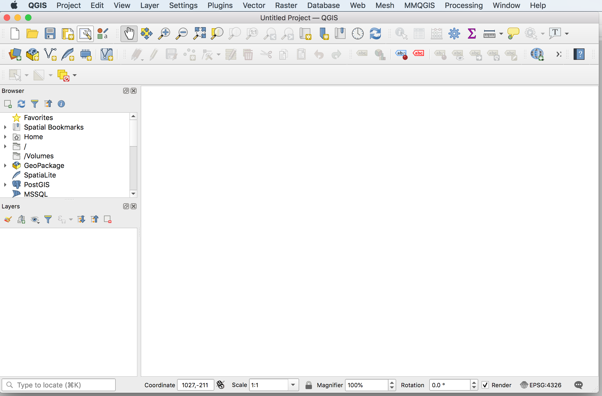

Note in the lower righthand corner you'll see EPSG 4326 is the default coordinate reference system (CRS).

### CRS = EPSG: 26913

I have reprojected all of our data layers to be in EPSG 26913, so let's go ahead and adjust the CRS of the project:

### Load Data

Let's load the vector data!

Click on the Open Data Source Manager  button. Make sure you select "Vector" on the side and that the "File" option is picked. You can then navigate to your data folder via the 3 little dots and select all of the .geojson files. HINT: You can select them all at once with the shift key.

Click "Add" then "Close" and you'll see a bunch of layers appear in your Layers Panel with colors automatically assigned to them. Don't worry if you don't see everything. It's probable that the polygon layer is hiding other layers.

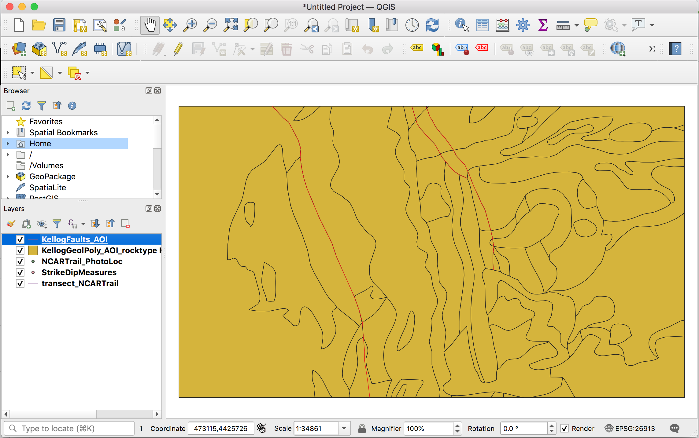

Now, let's load the raster data!

This time, after clicking on the Open Data Source Manager, select "Raster" on the side instead of "Vector" and navigate to the digital elevation .tif file (it's labeled with lat and lon references). You can also load the geologic map .tif files the same way if you grabbed them.

Loading the georeferenced geologic maps is optional. You may have skipped downloading these if you don't have a powerful computer. If you do load them, one trick to make rendering faster is to keep these layers turned off while you're working and only turn them on for reference when needed.

An alternate way to load data, especially when it's all in one location as it is in this case, is to make sure your Browser Panel is open, navigate to the files using the expanding arrows, then merely drag the files down to the Layers Panel.

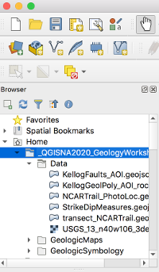

Right now, your QGIS interface should look a bit like this (the DEM will be covering the vector layers, but we'll fix that):

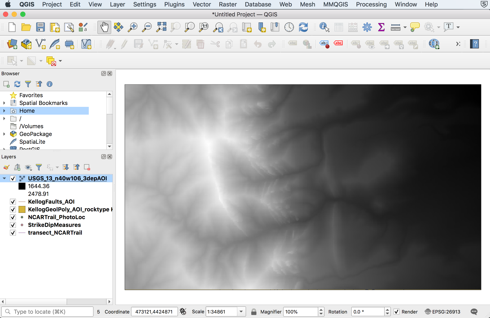

Now is a GREAT time to save your project and give it a name.

### Add Plugins

There are two plugins I suggest snagging for this tutorial:
- Quick Map Services - Allows you to load a basemap so you can have a visual reference!
- qProf - Used for constructing elevation profiles and pinning data for intrpreting cross sections

Go to the top dropdown menu, find "Plugins" and select "Manage and Install Plugins..." You'll get a window that gives you a candystore of functionality various developers have contributed to QGIS. Find the two plugins mentioned above with the search bar or scrolling down the list. Select them one at a time and click "Install Plugin." My interface looks a bit different because I already have them loaded:

We'll leave qProf until later, but for right now, let's use QuickMapServices to turn on the OSM standard basemap so we can see where our data is located. This plugin now lives under the "Web" dropdown menu because it doesn't load a layer, it reaches out to web services and renders a basemap for you:

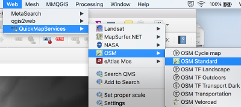

To see the OSM basemap (it automatically loads at the bottom), uncheck the other layers in the Layers Panel. This gives us a good sense of our area of interest or AOI:

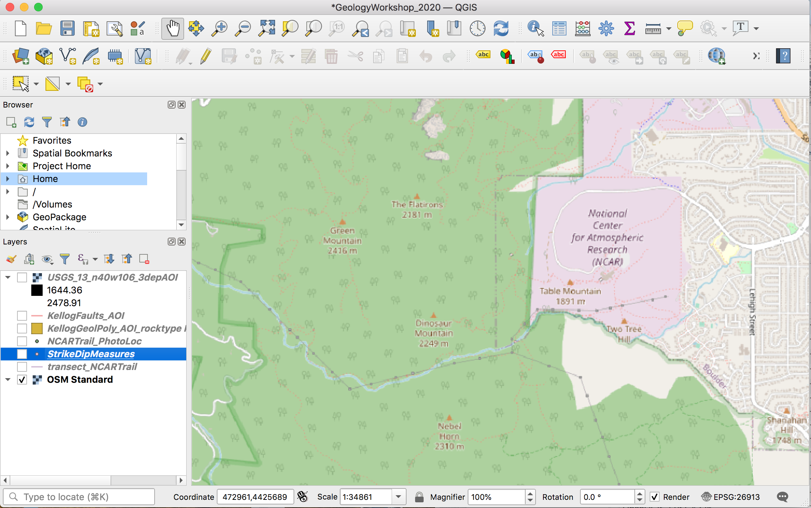

Notice the NCAR building and the trail that heads west from it to Dinosaur Mountain. Some of the data we'll be looking at was gathered along this trail.

### Explore Data

Take some time to understand the data. Click the layers back on and click+hold and drag them to reorder them. Most importantly, open the attribute tables to see what information is attached to the shapes you see! You can do this by right-clicking on the layer itself to expose another menu and select "Open Attribute Table."

HINT: this menu also contains a "Zoom to Layer" option at the top which is invaluable if you accidently move around in your map and lose your spot!

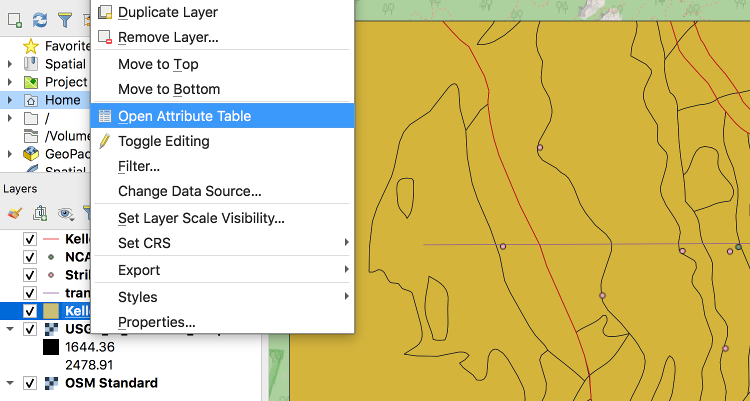

Turn off all the vector layers, and leave the USGS_13_n40w106_3depAOI.tif layer visible. You'll have noticed it didn't have an "Open Attribute Table" option because it's a different kind of data. The pixels that make up this raster hold elevation values, with the default lighter colors representing higher elevations. We're not going to use this layer for cartography, but we'll use it for creating our profile.

### Contour generation

To get a better sense of what this DEM means, let's generate contour lines from the raster. This can be helpful for those who are used to reading topographic maps.

Go to the "Raster" dropdown menu at the top, pick "Extraction", then "Contour..." and make sure the DEM file is showing in the options at the top.

Leave all the defaults, but notice you can pick the contour interval you'd like. We're leaving it at 10m. After you click Run, you'll have a temporary file appear in your Layers Panel. If it's hidden behind the DEM, drag it higher.

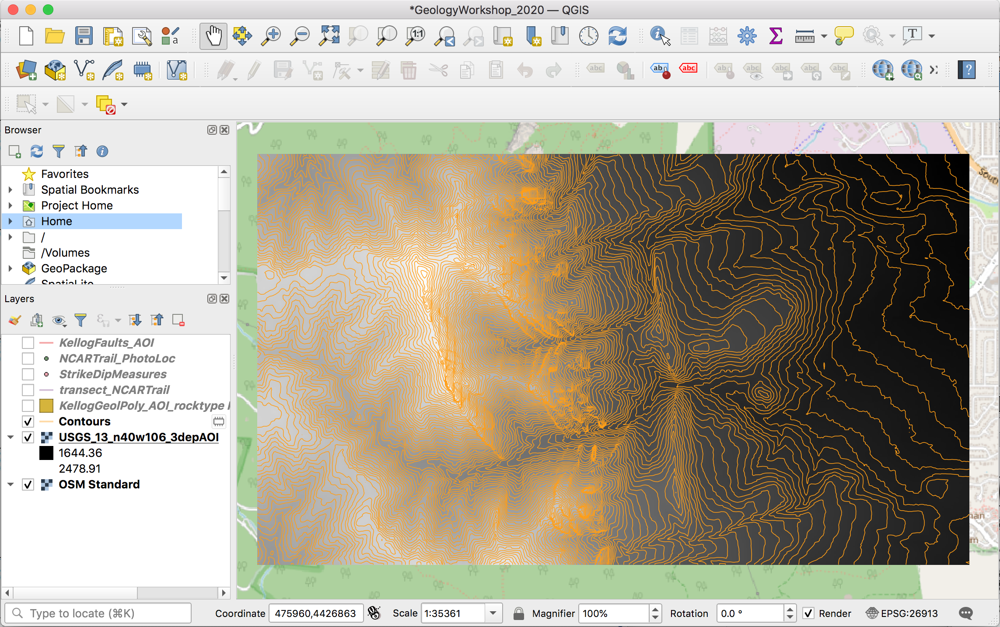

You can save this temporary layer to file if you'd like to keep it by right clicking on the layer and following the prompts under "Make Permanent."

### Symbolizing data

Now that we understand what data we have, let's make it look like a geologic map!

We have three layers to adjust for our geologic information to be more clear:
- Surface measurements
- Fault Lines
- Outcrops

Starting with the surface measurements, or our strike & dip information, we'll want to bring in one of the .svg figures from the .zip file: 6.02_bdg_incld.svg. These files are scalar vector graphics files that can be imported to QGIS to symbolize point data. We'll only use this one file showing the strike and dip of an inclined sedimentary bed, but there are MANY.

Go to the StrikeDipMeasures layer and right click on it. In the menu that appears, pick "Properties..." at the bottom to see the following window:

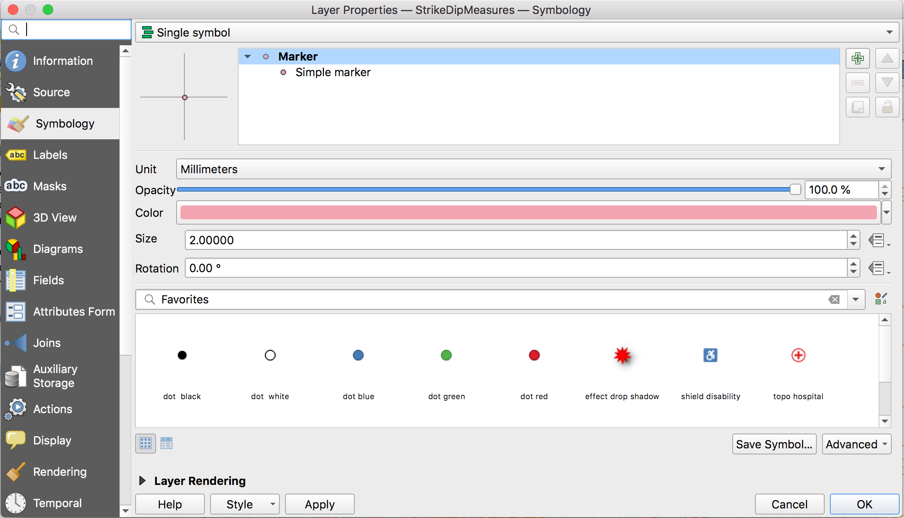

Next, click on "Simple Marker" and you'll see the options change a bit. Under "Symbol layer type," select SVG marker in the dropdown. To find our file to load, we'll need to scroll down until we see the 3-little-dots button below the example icons. Click on that button and navigate to load 6.02_bdg_incld.svg. If you can't find it, you may need to make sure the GeologyStructureSymbols folder is unzipped.

Change the width and heigth of the symbol to around 7 so it's visible. The default of 2 is too small. Go ahead and click okay to see how these look on your map. You should see a number of little T's show up that are all pointing to the east.

How do we get these to mirror the measurement information in the attributes? Remember, we have two values: strike (or Azimuth) and Dip to represent.

Go back to the layer's properties. We'll use these fields to show more information on the map. AZIMUTH can be used to Rotate the symbol:

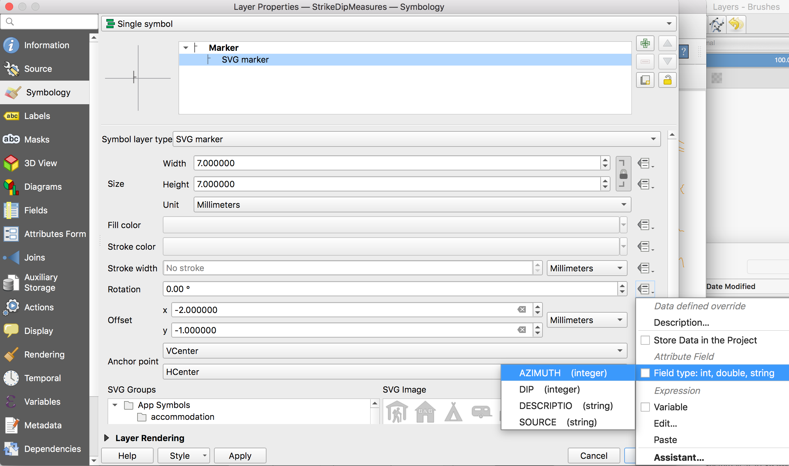

Then, find the little abc icon in the Labeling toolbar. Open the labeling dialog and pick "Single Labels" and use the DIP field for the label so we can see the angle information.

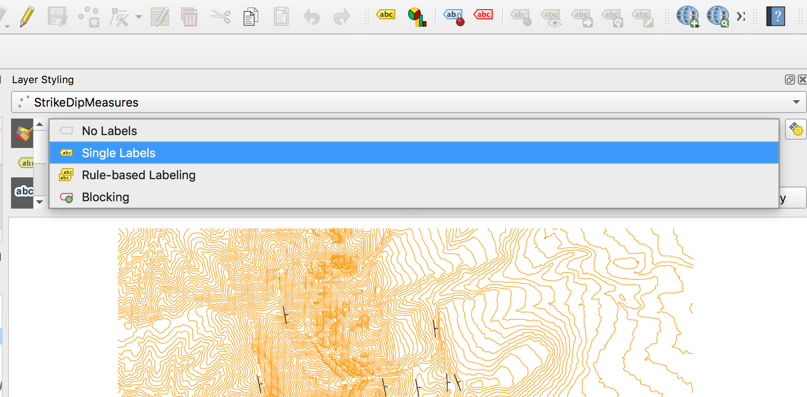

Next up are the faults. We're going to cheat and just use some basic line symbols that approximate the official USGS fault symbols.

Right click on the faults layer and open up its "Properties..." option. Make sure you're looking at the Symbology tab.

Instead of "Single Symbol" at the very top, we'll used "Categorized" here to show the difference between faults that are exposed on the surface and ones that are hidden by debris flows or other recent sediments. Use the field called "Exposure" for the value and then click the Classify button in the lower left.

After you click Classify, you'll see three categories show up with one being a catch-all if there is unclassified data. By clicking directly on the colored lines, you'll get a Symbol Selector window. Change the color to black and the width to .66 for the surface category. For subsurface, do the same but pick a dashed line.

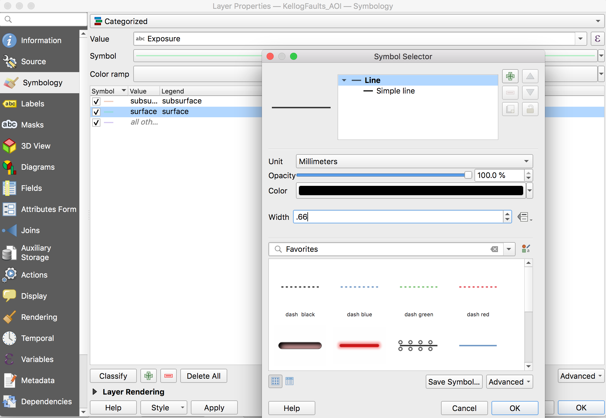

HINT: you can also change the color of your contours by double-clicking on their color bar in the Layers Panel to open the Symbology menu.

Now we have our surface information showing on our map!

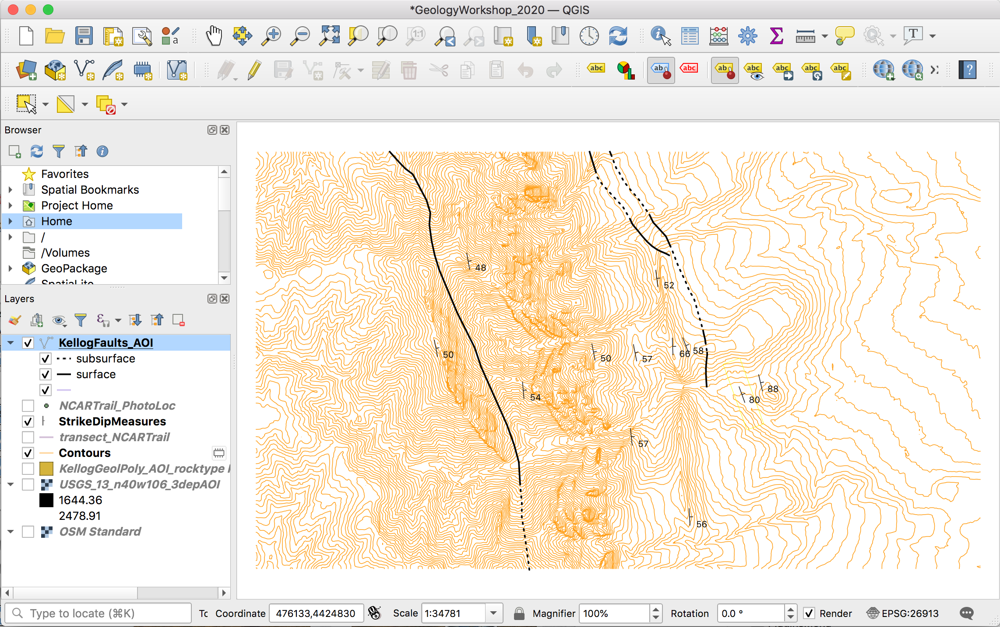

If you're like me and left just the contour showing, it's now time to turn on our polygon layer of outcrops so we can match it to a style file.

Here, we're going to load a style layer to connect to the "RockType" field in our data. This is tricky because some geologic knowledge is required to give this a decent shot. Just know that every field site is unique and not everything is going to match up to this particular styling file, but this is a great start.

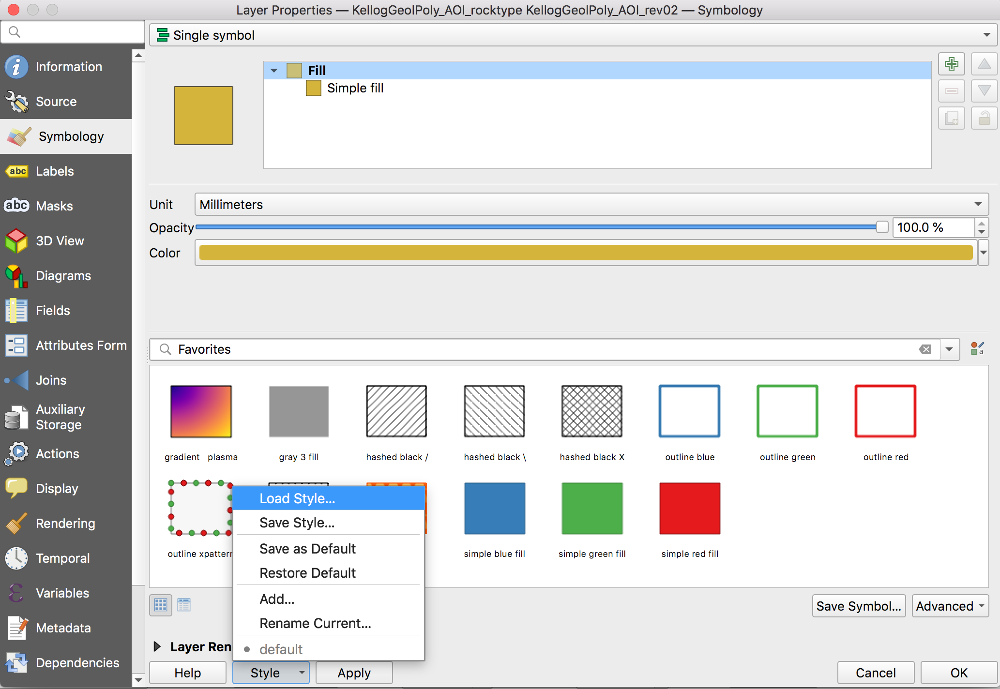

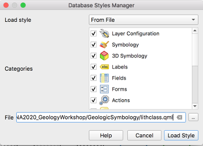

Yes, there are quite a few options for classiying rocks:

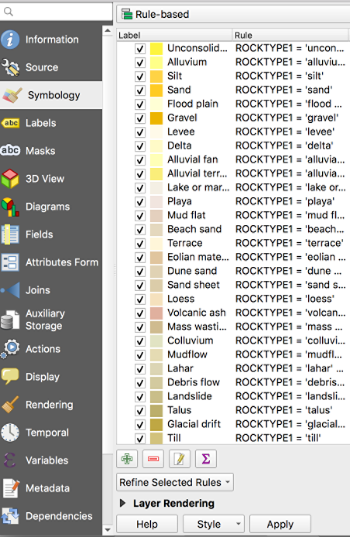

Rock formations have short-hand abbreviations based on their ages that can be used to label the outcrops on the map. Go to the small abc icon in the toolbar and turn on the Labeling Panel. If you don't see this icon, go to "View" in the dropdown menus, select "Toolbars" way down at the bottom and make sure the "Label toolbar" is toggled on.

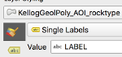

Now we have a bona fide geologic map! To put on the finishing touches, you would open a "New Print Layout" to add such things as a title, scalebar and geologic key. I will leave that to other tutorials. There are many out there!

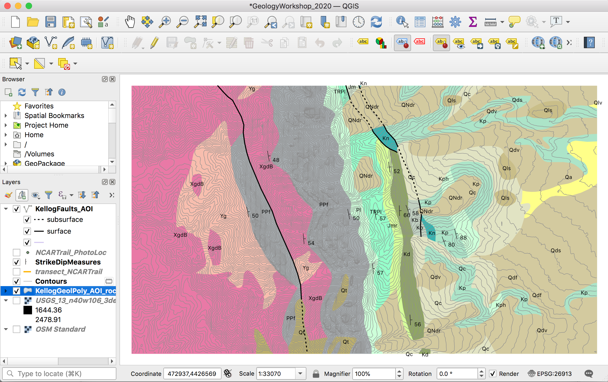

### Photos

What does this place look like? For fun and context, I stuck in a .geojson file that merely plots the two points where these pictures were taken. You can get a bit of the on-the-ground sense of the rock outcrops by looking at these and comparing them to the geologic information on our map. The first image is of the Dakota Formation showing beds where it's easy to measure strike and dip. The second image is looking towards the Flatirons (made of the Fountain Formation) while standing in the area of the Morrison and Lykins contact.

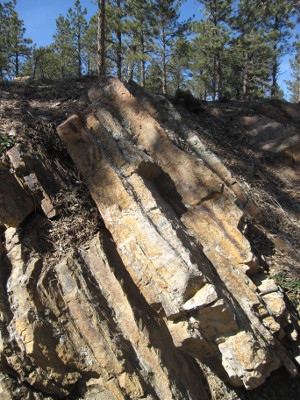 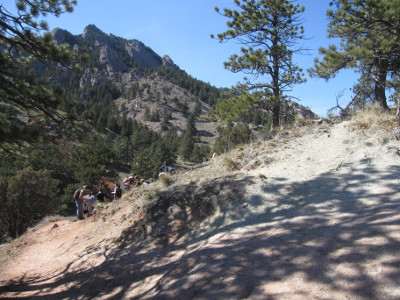

## Part IV Geologic Cross Section with qProf Plugin

We've made a representation of what our outcrops look like on the surface, but how do we take this information to construct a side view or a cross section of the geology?

### Transect

The first thing we want to do is determine a line, or transect, along where we want to "cut" down into the earth. Often, this happens in real life when road construction goes through a ridge and exposes the rocks in a "roadcut."  The images at the top of this tutorial are linked by a line on the geologic map from B to B' showing where the cross section was constructed. I have provided a line for you that goes along the NCAR trail:

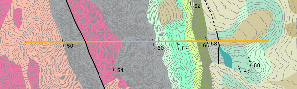

### Elevation Profile

Let's access the qProf plugin. You can find it in the Plugins dropdown menu at the top:

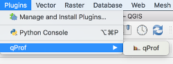

A new qProf panel will appear in your working space that has a number of tabs to pick from. We'll leave it on the default "Topography" tab for now:

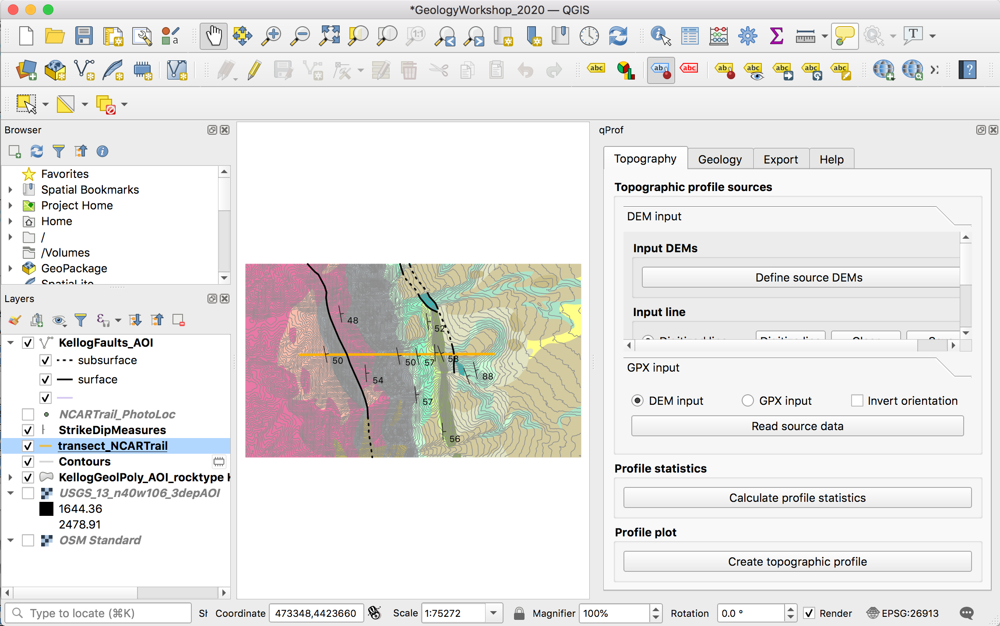

Going down the options under the Topography tab, pick our DEM after clicking "Define source DEMs". You'll see other rasters, like the OSM basemap, appear in the options, but we want the file with the elevation data.

Next, determine the transect information. You can hand draw any line (even one that isnt' straight!) on the map, but we're going to use the pre-built .geojson for the NCAR trail:

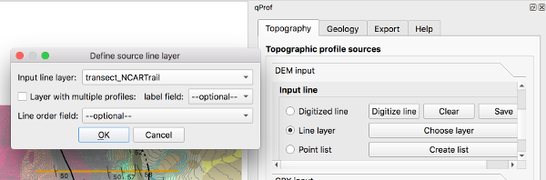

Continue down the options and click "Read source data", "Calculate profile statistics" and finally "Create topographic profile." Close the first two pop-up boxes after reading them. In the third, untick the "Set vertical exaggeration" box, but leave the other defaults.

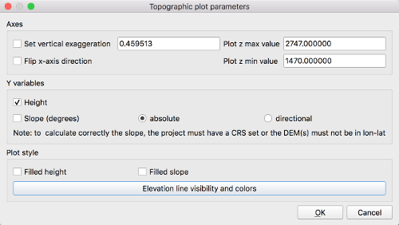

Click okay and you'll have an elevation profile!:

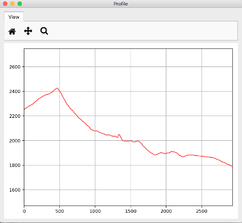

If you click and drag it around, you can stretch it to an aspect that you like.

NOTE: this is temporary information and will only stay available as long as you have qProf open. You'll export information that you want to keep before closing the plugin's panel!

### Pinning Geologic Information to Profile

The "Geology" tab in the qProf panel provides the tools to attach our geologic information from our map to the elevation profile. There are four different options, but we'll only use three of them for the data we have:
- Project geological attitudes
- (Project geological traces)
- Intersect line layer
- Intersect polygon layer

The attitudes are our strike and dip information. Make sure your window looks like the following with the strike and dip layer selected for our input. We want to select the RHR (right hand rule) option to have our data make sense:

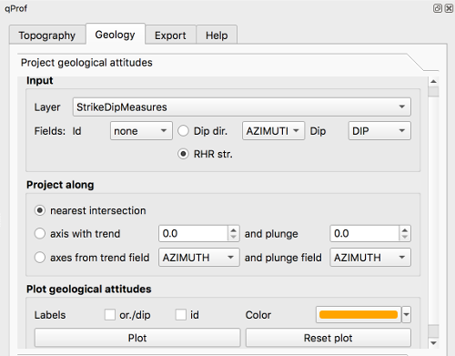

Click "Plot" at the bottom and you'll see a profile with the points of our data pinned to it. If you want to have the text information transferred to the profile, you can have the labels for "or./dip" toggled on.

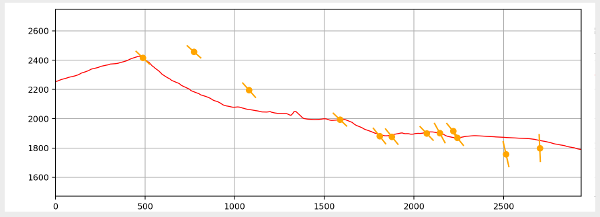

Next, expand the options for intersection the line layer by clicking on that title. You'll pick the faults .geojson as the layer here, and maybe add the Id field to bring over the fault name and change the color to black.

Lastly, we'll attach the outcrop information to our transect by intersection that polygon layer with our profile. Pick the polygon layer, then change the "Classification field" to "LABEL" and click "Intersect." You'll have an option to pick colors that get projected onto your profile and you want to make sure these match the style we have on the map. You can do this easily with the "Pick Color" option. Grab the colors directly off your map display with the eyedropper cursor to match the labels such as "Kph."

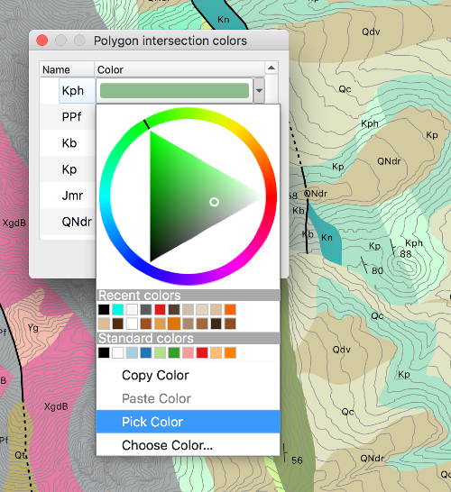

HINT: Mac is a little tricky here. Hover your cursor over the appropriate color on the map and hit the spacebar instead of clicking. The eyedropper picker seems to work fine on the PC across the whole screen.

Your profile and nascent cross section will look like this beautiful jumbled mess:

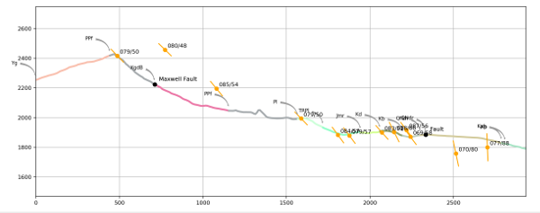

Don't worry about all the overlapping and craziness. This is where our vector graphics editor, Inkscape, will save us!

### Export Figure

While still in qProf, let's create a graphics file to work with in Inkscape.

After adjusting your profile to the aspect you want, go to the "Export" tab and click on "Figure." Adjust the size parametes as you'd like and give your file a pathname, a name, and an .svg ending.

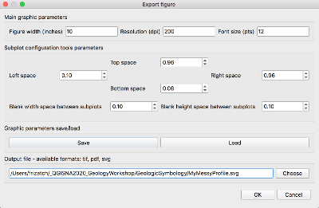

HINT: if you don't use a pathname, your figure will land in the folder with your applications. Pathnames can be copied on PCs from File Explorer Windows after clicking on the top bar to highlight the path. Pathnames on macs can be found by: Right click > Option (alt) HOLD > Copy pathname.

## Part V: Interpreting a Cross Section and Building it in Inkscape

Most of this workshop is about working with geologic data in QGIS, but there is a lot of fun in trying to interpret a cross section from what we can see on the surface, so we'll take a small dive into how to do that with Inkscape, a vector graphics program that gives us some tools to create detailed drawings.

To open our figure we exported from qProf, we can either find our file and use "Open with..." and pick Inkscape, or we can open Inkscape and select "Open..." from the "File" dropdown menu.

When you bring in your jumbled cross section .svg file, it will look like this:

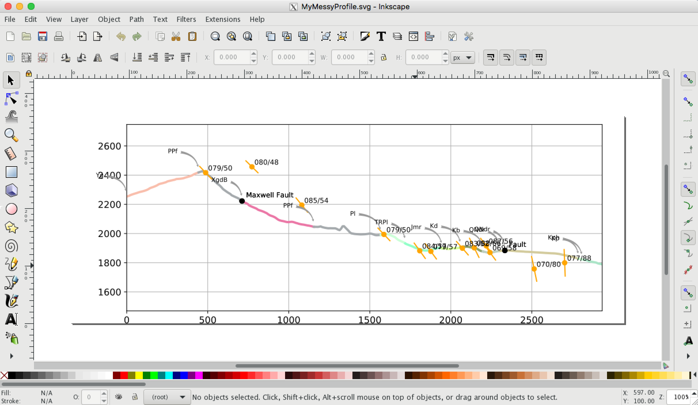

### Ungrouping

If you try selecting objects, you'll notice that in order to work with them, you'll need to ungroup these vector graphics ... twice.

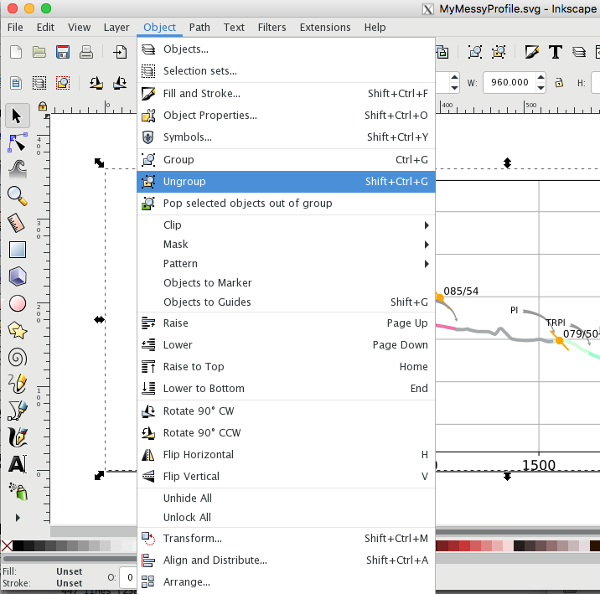

But after the ungrouping, you get a mess and it's hard to click that carefully:

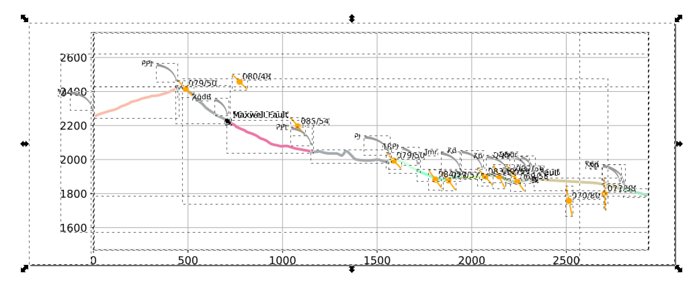

### Layers!

Putting all of the objects into layers that you can lock and edit with more control is highly recommended.

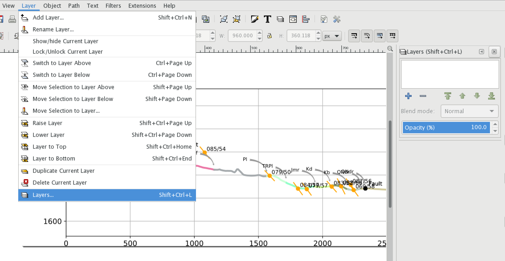

Think about what makes sense to regroup, and create a layer for each one of these groups:

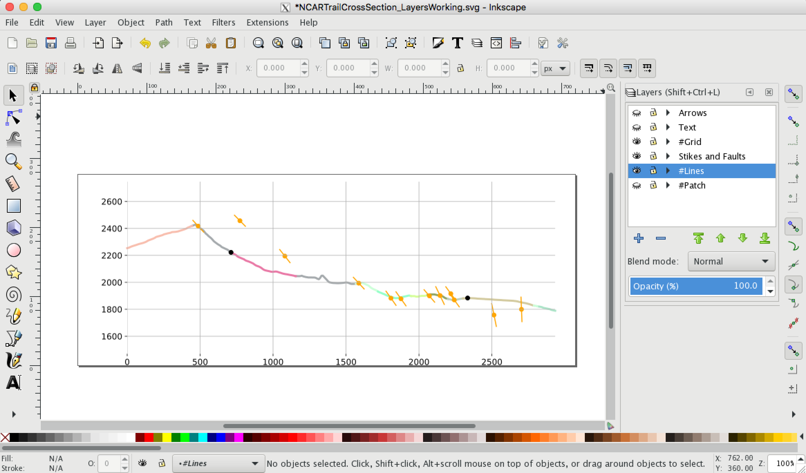

You'll be able to turn off the labels so you can see what you're doing. You can click them back on quickly when you need the information. Granted, you didn't have to export the labels at all, which would've been okay for this cross section, but sometimes they are needed for clarification.

### Using Surface Measurements to Estimate Underground Geology

*Draw that cross section!*

The hard and fun part is to use the information we pinned to our profile to try and draw the beddings structures underground. Think back to the diagrams in the first part of this tutorial showing how the intersection of a fault line, for example, may have adjusted bedding relationships, and what can we interpret based on what we know? We're just creating a model and that's all cross sections ever are because it's impossible to get bore hole data (actual underground sampling) everywhere.

One rule of thumb we'll use, is assuming sedimentary beds are uniform in thickness unless you have data that implies otherwise.

Happily, we're working mainly with sedimentary beds, so we can draw these uniform beds at angles going down based on our dip data which we've projected onto our profile! We'll create guid lines, then fill in our cross sections with colored polygons to show where we think the bedding sits.

*Faults First*

Look at where the fault lines have cut across. These can be major disruptions and getting a sense of their effect first is important. Let's look at the Maxwell fault. Our hint about what happened here is that we're seeing the Fountain formation twice on our geology map and more of that "pink stuff" (granodiorite) got shoved up between it. This is different from a shear fault which are often represented in the media by the shift of the road paint line.

We don't quite know the angle of the fault from our data, so we'll draw a straight line.

*Dip Angles*

We can drop lines from our dip angles then move them to the contact boundaries at the surface of our profile.

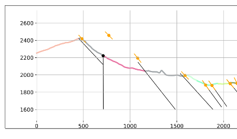

After getting some guidelines, we can then draw in our colored beds by following along our guides and then matching our Fill and Stroke colors to the outcrop color:

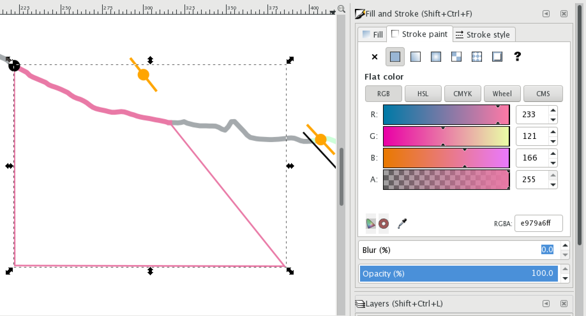

There is a lot of geology to think about. The dip angles aren't parallel, so maybe our data isn't perfect or maybe the faults have caused some warping. Other interesting things are the Quaternery deposits (debris and landslides) which are likely shallow and acting as a blanket on top of the rock formations underneath. We would draw this in as a layer of icing. Also, the rocks to the west (left in this case) are igneous, so drawing in an artistic curved line or even a question mark on the boundary between Yg and XgdB would be appropriate. Again, we're just building a model based on the information we have. It's a fun puzzle.

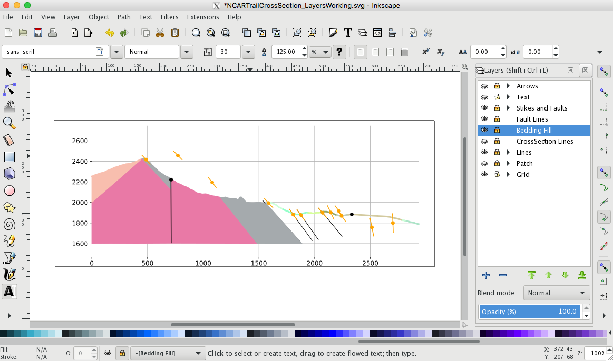

### Detailing

Inkscape has all sorts of tools for working with detailed graphics like these. I encourage you to hunt down all the great tutorials that are out there for this software. But there is one little detail I want to fix ... easily done with the object flipping option:

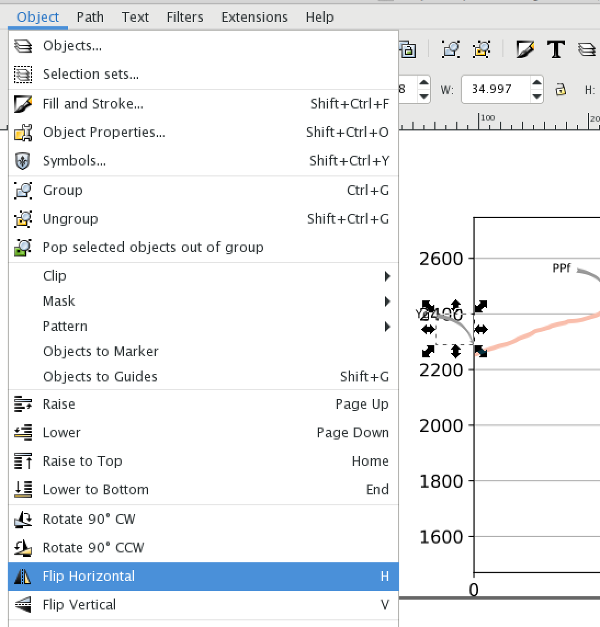

This little arrow hanging off the edge just needed to be put inside the figure:

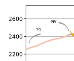

## Resources

### Maps and (maybe) GIS data

- [National Geologic Map Database](https://ngmdb.usgs.gov/ngmdb/ngmdb_home.html) source of [Kellog 2008 geologic map](https://ngmdb.usgs.gov/Prodesc/proddesc_84408.htm) and [Wells 1967 geologic map](https://ngmdb.usgs.gov/Prodesc/proddesc_21289.htm)
   
- [Colorado Geologic Survey](https://coloradogeologicalsurvey.org/gis-data-map-portal/)

Look for similar state geologic survey office's websites!

- [Canada Geologic Survey](https://www.nrcan.gc.ca/science-data/science-research/earth-sciences/geography/topographic-information/10785)

- [Servicio Geologico Mexicano](https://www.gob.mx/sgm)

Google around for your country of interest with "Geological survey" and "GIS data" and you could turn something up!

### Geologic Symbology
- Geologic symbols: [.svg library](http://members.iinet.net.au/~richard.langford/USGS.zip) (link is a direct download!) Dr. Richard Langford created from USGS pdfs. Here's his [website](http://www.richardlangford.com/).
- FGDC standards for [geologic symbology](https://ngmdb.usgs.gov/fgdc_gds/geolsymstd.php)
- Interesting [post](https://opengislab.com/blog/2019/3/16/converting-esri-styles-to-qgis-styles-using-slyr) about using Nyall Dawson's SLYR for converting ESRI style to QGIS XML
- USGS [publication](https://pubs.usgi.gov/of/2005/1314) on making ArcMap lithology styles

### Elevation Data
- [Shuttle Radar Topography Mission (SRTM)](https://gisgeography.com/srtm-shuttle-radar-topography-mission/)

- [JAXA](https://www.eorc.jaxa.jp/ALOS/en/aw3d30/)

- [USGS 3Dep](https://nationalmap.gov/preview/3DEP/index.html)

***

Thanks to Miles Husky and Patrick McGranaghan for their help and inspiration!

***

## *Post-Webinar Notes*

Screen shots in this tutorial were done with QGIS 3.14 on a mac. The [live webinar](https://www.youtube.com/watch?v=bYIgS2Lu1UA&feature=youtu.be)(YouTube video also linked at http://qgis.us/qgis-na-2020.html) was done with QGIS 3.14 on a PC.

A question was asked about how to bring in information if you DO have bore-hole, seismology and other underground data. The plugin [Midvatten](https://github.com/jkall/qgis-midvatten-plugin/wiki) was recommended and it looks to be the perfect thing!

Color Schemes for USGS geologic maps: This great [reference](https://pubs.usgs.gov/tm/2005/11B01/05tm11b01.html) was posted in the chat for the webinar.

Webinar corrections (send a PR if you have one to add!)
- Around 2:17:00, I called a Quaternary deposit a sandstone when I meant to say, "sand" or some such... the "brown thing" is actually "Debris-flow deposits and Rocky Flats Alluvium"
