# Geologic Maps and Cross Sections in QGIS
Workshop for QGIS NA 2020 introducing geologic maps and cross-sections for students and hobbyists

Have you ever been curious about how the rock formations you see when you’re hiking through a varying landscape look underground? This workshop will give you an introduction to satisfying that curiosity with QGIS!

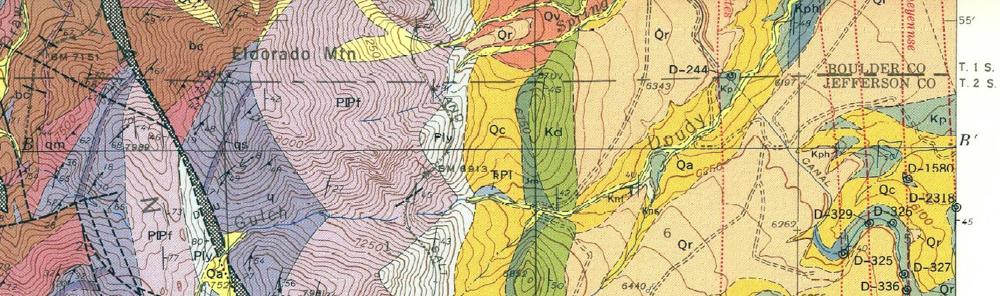
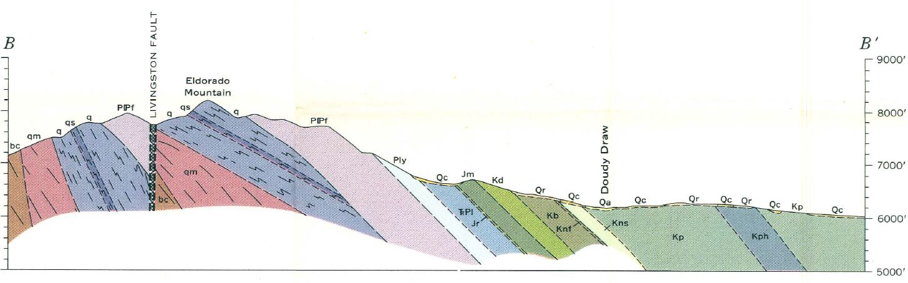
*Detail and cross section from Eldorado Springs Geologic Quadrangle, Wells, 1967*

## FOSS Software Needed:
- QGIS can be downloaded at https://www.qgis.org/
- Inkscape can be downloaded at https://inkscape.org/

Please consider donating to these organizations!

## Data for tutorial:
You can retrieve the files you need for this tutorial from this [dropbox page](https://www.dropbox.com/sh/fth75xanut760i3/AACtcFVLZ_zMq9NBN5mNb9fRa?dl=0). You'll find:
- geospatial data
- geologic symbology
- georeferenced geologic maps (these large files are not necessary, but they can be useful for visualization)

## What this tutorial will cover:

Introduction to the rock cycle and main rock types:
- igneous
- sedimentary
- metamorphic

Quick look at the Geologic Time Scale

Orientation to some geologic terms and structures
- strike and dip
- antclines, synclines and monoclines
- faults (normal, thrust or reverse, strike/slip)

2D geologic graphics with  and 
- import geologic symbol libraries
- stylize a geologic map
- create a geologic cross section with the qprof plugin and Inkscape

You'll learn how to interpret the symbols on a geologic map that represent the surface exposure of sedimentary layers. You'll also get a start on how the information from this surficial data can help estimate what the formations look like underground.

## What this tutorial won't do:

This tutorial won't make you a structural geologist qualified to make geologic maps from scratch. Real geologic maps are based on mind-boggling amounts of scientific training and field work. For more information see this [USGS description](https://www.usgs.gov/core-science-systems/national-cooperative-geologic-mapping-program/science/introduction-geologic?qt-science_center_objects=0#qt-science_center_objects)

# GEOLOGY!
## Part I: Rocks & Time

*The Rock Cycle*

The surface of the earth is a dynamic system and this applies to rocks as well! The time scale is on a longer extent than what we can see in the motion of water, for example. It's harder for our brains to grasp, but rocks do move.

The simplistic summary of the rock cycle is: 
- Molten material from levels below the earth's crust cools into solid rocks as it comes to or near to the earth's surface creating igneous rocks.
- Erosion wears existing rocks into sediment or dissolved chemicals that generally get carried from higher elevations and deposited into flat layers at lower elevations.
- These layers get buried and compressed and turned into sedimentary rocks. If they get exposed to an environment with enough heat and pressure to start changing the mineral structure, they become metamorphic rocks or melt completely again.

There are many different subsets of rock types under the three main just mentioned (*igneous*, *sedimentary* and *metamorphic*). The difference between them depends on chemical compositions and mineral sizes, both factors being dependent on the environment in which the rock was formed. See this [page](https://geology.utah.gov/map-pub/survey-notes/glad-you-asked/igneous-sedimentary-metamorphic-rocks/) for more details.

Here are some classic examples of the three main rock types:

GRANITE (an igneous rock type):

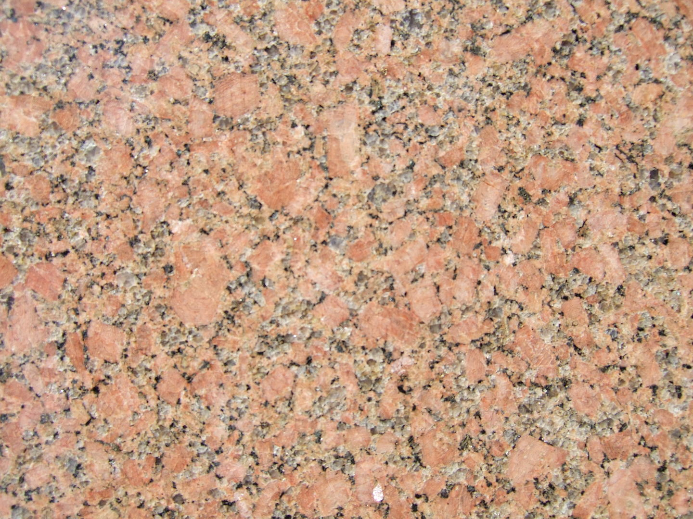

*By I, Friman, CC BY-SA 3.0, https://commons.wikimedia.org/w/index.php?curid=2421115*

SANDSTONE (a sedimentary rock type):

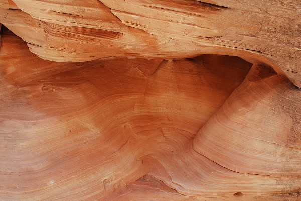

*By Hasmodius, CC BY-SA 4.0 https://commons.wikimedia.org/wiki/File:Valley_of_Fire_Sandstone_layers_exposed_by_erosion.jpg*

MIGMATITE (a metamporhic rock type):

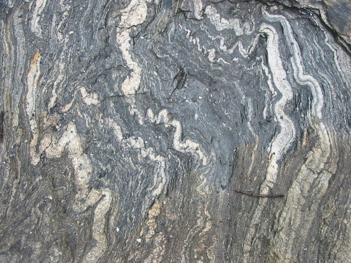

*https://commons.wikimedia.org/wiki/File:Migma_ss_2006.jpg*

### Geologic Time

The rock cycle happens over times that we have a hard time imagining. For reference, see the figure below that diagrams out geologic time. Note: Ma stands for "millions of years ago."

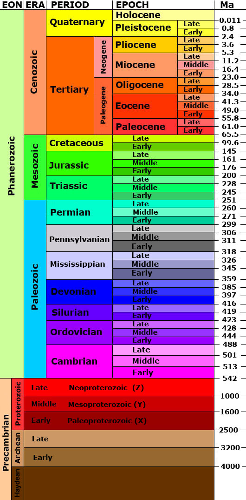

## Part II: Structures

We'll be focusing on sedimentary rocks for this discussion. When sedimetary layers are deposited, they are put down in flat layers. After the layers are changed into rock, all sorts of forces can then act on them to deform the orientation of these sedimentary rocks. Some of the more simplistic terms and structures are:

- Dip = When a sedimentary bed is tilted, dip describes how many degrees it has shifted from horizontal in a particular location

- Strike = When the bed tilts, it does so around an axis. The direction that axis points is the strike of that bed.

*Diagram by GeologyWolf*

- Syncline = a downward fold in sedimentary beds

- Anticline = an upward fold in sedimentary beds

- Monocline = a fold that only dips in one direction (one part is elevated relative to the other)

*Diagram by Pearson Scott Foresman*

Imagine slicing off the top of these folds (eroding them away) and what that may look like exposed on the earth's surface.

- Faults = fractures through rocks showing a significant discontinuity in the volume of rock

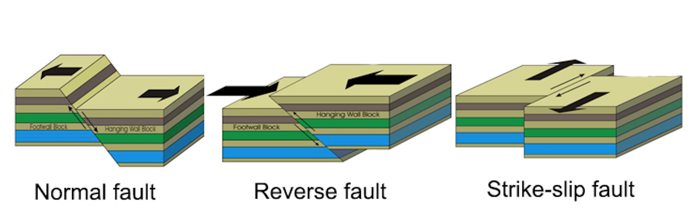

*Diagram from www.GeologyPage.com*

Plate tectonic forces also work on igneous and metamporhic rocks, but their effects are most obvious on sedimentary rocks.

### Representing structures on a map

The black lines and symbols you see scattered on geologic maps are a short-hand for describing the structures mentioned above. See this [guide](https://commons.wvc.edu/rdawes/G101OCL/Basics/BscsTables/geomapsymb.html#sdtable) for examples. The full symbology reference for the USGS can be found published in this [standard](https://ngmdb.usgs.gov/fgdc_gds/geolsymstd.php).

There is also an amazing source of .svg files of the point symbols used in geologic maps created by Dr. Richard Langford, a geologic consultant living in Tasmania.  Some of these symbols are included in the data folder for this tutorial.

The blobs of color you see on geologic maps show the surface exposures of different kinds of rocks, often with their ages wrt the Geologic Time Scale. Refer to the individual legends of each specific geologic map for more information as these colors and patterns can vary some. We'll explore more why this is when we symbolize our data.

# MAPS AND CROSS SECTIONS!

First of all, we need to pick a particular location to investigate. Because I'm familiar with it, I'm going to introduce you to the landscape near the National Center for Atmospheric Research (NCAR) in Boulder, CO USA. There are iconic geologic formations in this area known as the Flatirons. We're going to look at the landscape that's a bit south of these often photographed mountains:

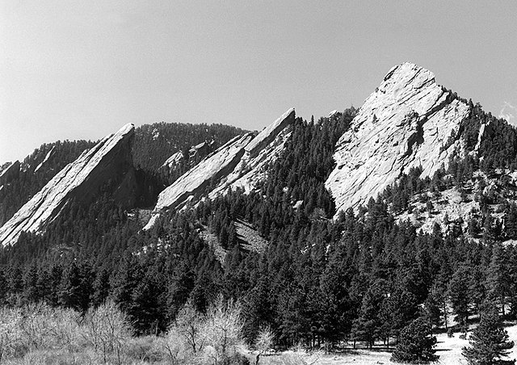

Boulder Flatirons by Paulhaberstroh [CC by SA](https://creativecommons.org/licenses/by-sa/4.0/legalcode)

To dive into making a basic geologic map of this area, we need the information structural geologists have collected by examining the surface exposures of the rocks. We'll then take that information and combine it with elevation data to construct our best interpretation of what these rocks look like in a profile view or a "cross section."

You should see three different folders of files in the [dropbox link](https://www.dropbox.com/sh/fth75xanut760i3/AACtcFVLZ_zMq9NBN5mNb9fRa?dl=0) also shared at the top of the tutorial. To get everything listed below, just click on the "Download" button in the upper right and all the contents will come as a .zip file. Please note that you'll have to unzip the file called QGISNA2020_GeologyWorkshop in a location on your local computer where you want to keep your data. There is also a sub-.zip file for the geologic symbols that needs to be unzipped.

If you're worried about large files, you can skip downloading the geologic maps and download just the Data and GeologicSymbology folders by clicking down one more layer on dropbox.

Data
 - Digital Elevation Model or DEM (USGS_13_n40w106_NAD83Z13)
 - Surface Measurements (StrikeDipMeasures.geojson)
 - Fault lines (KellogFaults_AOI.geojson)
 - Geologic formation surface exposures (KellogGeolPoly_AOI_rocktype.geojson)
 - Transect (transect_NCARTrail.geojson)
 - Photo Locations (NCARTrail_PhotoLoc.geojson)
 
GeologicMaps - Retrieved from the [National Geologic Map Database](https://ngmdb.usgs.gov/ngmdb/ngmdb_home.html)
 - Kellog
 - Wells
 
GeologicSymbology
 - Rock type styling (lithclass.qml)
 - Subset of geologic symbols (.zip file)

*Resources for finding this kind of information for other areas are listed at the end of the tutorial.*

## Part III: Geologic Maps in QGIS

### Open QGIS

When you first open the software, you might see other projects that you've worked on before. Just select "New Project" and you'll see a GUI like this:

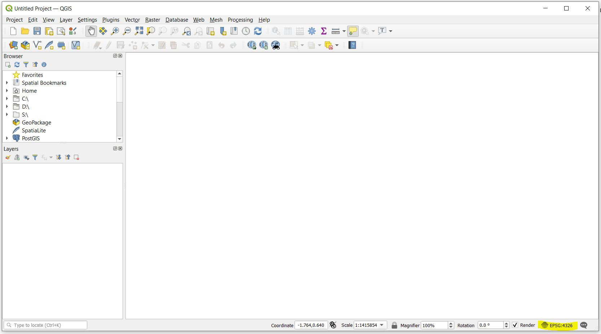

Note in the lower righthand corner you'll see EPSG 4326 (WGS 84) is the default coordinate reference system (CRS).

### CRS = EPSG: 26913

I have reprojected all of our data layers to be in EPSG 26913, so let's go ahead and adjust the CRS of the project:

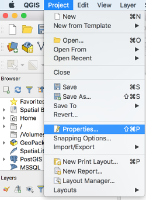

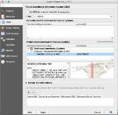

### Load Data

Let's load the vector data!

Click on the Open Data Source Manager  button. Make sure you select "Vector" on the side and that the "File" option is picked. You can then navigate to your data folder via the 3 little dots and select all of the .geojson files. HINT: You can select them all at once with the shift key.

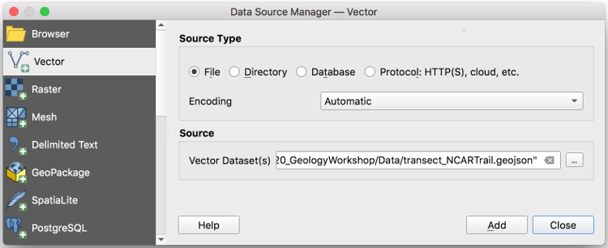

Let's load the raster data!

This time, after clicking on the Open Data Source Manager, select "Raster" on the side instead of "Vector" and navigate to the digital elevation .tif file (it's labeled with lat and lon references). You can also load the geologic map .tif files the same way if you grabbed them.

Loading the georeferenced geologic maps is optional. You may have skipped downloading these if you don't have a powerful computer. If you do load them, one trick to make rendering faster is to keep these layers turned off while you're working and only turn them on for reference when needed.

An alternate way to load data, especially when it's all in one location as it is in this case, is to make sure your Browser Panel is open, navigate to the files using the expanding arrows, then merely drag the files over to the Layers Panel.

### Add Plugins

There are two plugins I suggest snagging for this tutorial:
- Quick Map Services - Allows you to load a basemap so you can have a visual reference!
- qProf - Used for constructing elevation profiles and pinning data for intrpreting cross sections

We'll leave qProf until later, but for right now, let's turn on the OSM standard basemap so we can see where our data is located. Notice the NCAR building and the trail that heads west from it:

### Explore Data

- load layers
- explore (vector data and raster GeoTIFFS)
- plugin(s) need qprof, quickmapservices is nice for OSM reference layer, not necessary
- Symbolizing - do structures THEN geolpoly
- labeling
- discuss DEM
- create contours raster extract 10m

## Part IV Geologic Cross Section with qProf Plugin
- 

## Resources
Maps and (maybe) GIS data
- [national geologic map database](https://ngmdb.usgs.gov/ngmdb/ngmdb_home.html)
 
     [Kellog 2008 geologic map](https://ngmdb.usgs.gov/Prodesc/proddesc_84408.htm)

     [Wells 1967 geologic map](https://ngmdb.usgs.gov/Prodesc/proddesc_21289.htm)

Geologic Symbology
- Geologic symbols: [.svg library](http://members.iinet.net.au/~richard.langford/USGS.zip) (link is a direct download!) Dr. Richard Langford created from USGS pdfs. Here's his [website](http://www.richardlangford.com/).
- FGDC standards for [geologic symbology](https://ngmdb.usgs.gov/fgdc_gds/geolsymstd.php)

